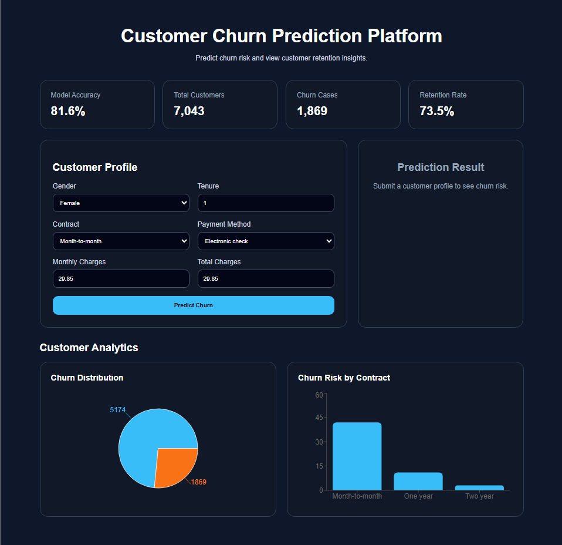

Customer Churn Prediction Platform

Overview:
Customer Churn Prediction Platform is a full-stack machine learning application that predicts whether a customer is likely to leave a telecom service.

The system uses a Logistic Regression model trained on the Telco Customer Churn dataset and provides:
1.Churn prediction
2.Churn probability score
3.Risk classification
4.Key risk factors
5.Retention recommendations
6.Analytics dashboard

Live Demo:
Frontend:
https://customer-churn-platform-ten.vercel.app/

Backend API:
https://customer-churn-platform.onrender.com/docs

Dashboard Preview:
Main Dashboard:

Prediction result:

